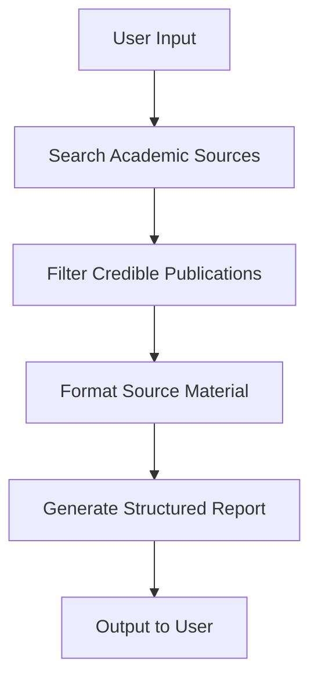

# Academic Literature Review Generator

## Overview
The Academic Literature Review Generator is an AI-powered agent that automates the process of creating comprehensive literature reviews. It searches academic sources, filters for credible publications, and generates structured reports with proper citations - saving researchers hours of manual work.


## What It Does
- 🔍 **Automated Research**: Searches academic databases for relevant sources
- 🧪 **Credibility Filtering**: Identifies peer-reviewed, reputable publications
- 📝 **Structured Reports**: Generates literature reviews in Markdown format with:
  - Title and abstract
  - Introduction and key findings
  - Comparative analysis
  - Conclusion with research gaps
  - Properly formatted references
- 💾 **Exportable Results**: Allows downloading reports for academic use

## How It Works
### Agent Architecture


### Technical Components
1. **LangGraph Agent Orchestration**:
   - Manages the research workflow
   - Maintains state between processing steps
   - Handles error recovery

2. **Gemini 1.5 Flash**:
   - Processes source materials
   - Generates structured academic content
   - Ensures proper citation formatting

3. **Tavily Research API**:
   - Searches specialized academic databases
   - Focuses on peer-reviewed sources
   - Retrieves full-text content when available

4. **Streamlit UI**:
   - Intuitive research topic input
   - Customizable parameters
   - Real-time progress tracking
   - Downloadable output

## Where It's Used
### Academic Applications
- **Researchers**: Quickly survey existing literature in a new field
- **Graduate Students**: Accelerate literature review process for theses
- **Professors**: Prepare comprehensive background for new research proposals
- **Librarians**: Assist patrons with academic research requests

### Professional Applications
- **R&D Teams**: Stay current with scientific advancements
- **Policy Analysts**: Gather evidence for policy recommendations
- **Pharmaceutical Companies**: Track medical research developments
- **Consulting Firms**: Prepare industry analysis reports

## Why It's Beneficial
### Time Savings
⏱️ Reduces literature review process from weeks to minutes

### Quality Enhancement
✅ Ensures:
- Credible academic sources
- Proper citation format
- Balanced presentation of conflicting findings
- Identification of research gaps

### Accessibility
📚 Makes academic research accessible to:
- Non-specialists entering new fields
- Researchers with limited library access
- Professionals needing quick overviews

### Customization
⚙️ Allows adjustment of:
- Citation style (APA, MLA, Chicago)
- Research depth (Brief to Comprehensive)
- Number of sources (5-20)

## Getting Started
### Prerequisites
- Python 3.9+
- Google API key (for Gemini)
- Tavily API key (for academic search)

### Installation
```bash
# Clone repository
git clone https://github.com/yourusername/academic-review-agent.git

# Navigate to project
cd academic-review-agent

# Install dependencies
pip install -r requirements.txt

# Set up environment variables
echo "GOOGLE_API_KEY=your_google_key" > .env
echo "TAVILY_API_KEY=your_tavily_key" >> .env

# Launch application
streamlit run streamlit_app.py
```

### Usage
1. Enter your research topic
2. Adjust parameters (citation style, depth, sources)
3. Click "Generate Literature Review"
4. Review and download the report

## Future Enhancements
- Journal-specific formatting options
- Reference management integration (Zotero, EndNote)
- Collaborative editing features
- Historical trend analysis
- Multi-language support

## Contribution
Contributions are welcome! Please see our [contribution guidelines](CONTRIBUTING.md) for details.

## License
This project is licensed under the MIT License - see the [LICENSE](LICENSE) file for details.